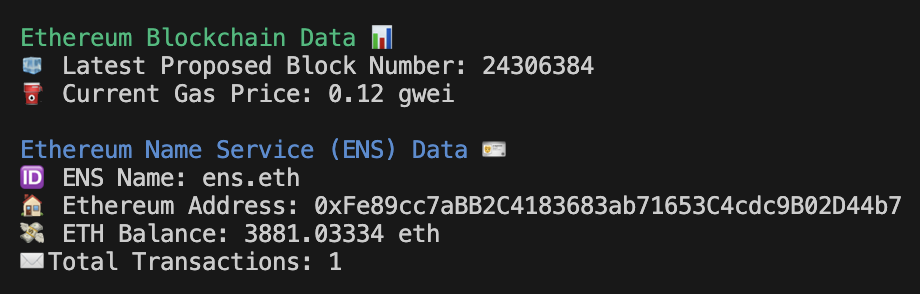

# eth-connect
Connect to Infura, get Ethereum blockchain data, and display the results.

Built with Python and the web3.py library. 

## Setup
### Infura
1. Create an [Infura](https://www.infura.io/) account
2. Within the MetaMask Developer Portal, create an API key

### Git Bash
1. Open Git Bash, then run the following command: 
`
code ~/.bashrc
`
2. In the bashrc file, type the following: 
`
export INFURA_KEY="<API key from Infura>"
` 

## Usage
Run the connect.py script:
`
python connect.py
`

OR

Run the connect.py script with optional arguments:
`
python connect.py --ens <insert ENS name>
`
